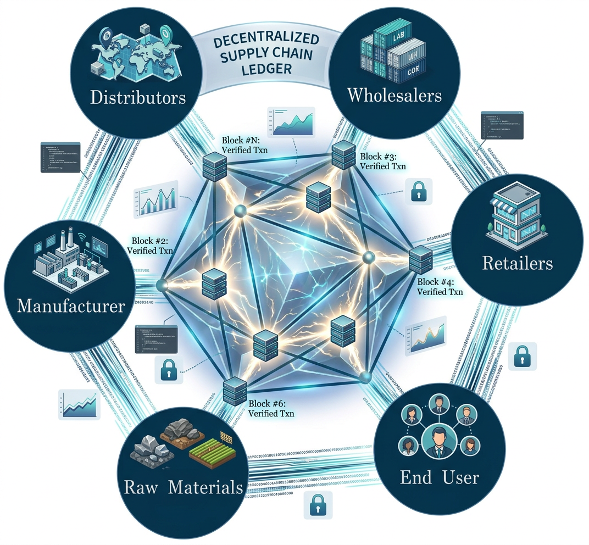

# Supply Chain Blockchain DApp

<div align="center">



**A decentralized supply chain management system built on Ethereum blockchain using Solidity smart contracts, Next.js, and Web3.js**

[](https://github.com/faizack/Supply-Chain-Blockchain/actions/workflows/ci.yml)
[](https://opensource.org/licenses/MIT)
[](https://github.com/faizack/Supply-Chain-Blockchain/stargazers)
[](https://www.typescriptlang.org/)
[](https://nextjs.org/)
[](https://soliditylang.org/)
[](https://hardhat.org/)

[Star](https://github.com/faizack/Supply-Chain-Blockchain) • [Fork](https://github.com/faizack/Supply-Chain-Blockchain/fork) • [Report Bug](https://github.com/faizack/Supply-Chain-Blockchain/issues) • [Request Feature](https://github.com/faizack/Supply-Chain-Blockchain/issues)

</div>

---

<!--
## 🎥 Demo

Watch the demo video: [Canva Design Demo](https://www.canva.com/design/DAFb-i9v_cM/-fK0pKTuOkFq5dfCPQxh_w/watch?utm_content=DAFb-i9v_cM&utm_campaign=designshare&utm_medium=link&utm_source=publishsharelink)
-->

## Table of Contents

- [Overview](#-overview)
- [Features](#-features)
- [Technology Stack](#-technology-stack)
- [Architecture](#-architecture)
- [Installation](#-installation)
- [Running the Project](#-running-the-project)
- [Usage Guide](#-usage-guide)
- [Smart Contract Details](#-smart-contract-details)
- [Contributing](#-contributing)
- [License](#-license)

## Overview

**Supply Chain Blockchain DApp** is an open-source, blockchain-based supply chain management application built with Solidity smart contracts, Hardhat, Next.js, Web3.js, and MetaMask. It demonstrates how to build an end-to-end Ethereum decentralized application (dApp) for transparent, secure, and traceable pharmaceutical supply chains.

This repository is ideal for developers who want to learn:

- How to build a full-stack Ethereum dApp with **Solidity**, **Hardhat**, **Next.js**, and **Web3.js**
- How to design **role-based access control** and **product lifecycle tracking** on the blockchain
- How to integrate a smart contract backend with a modern React/Next.js frontend

<!-- ## Demo and Screenshots

> A short GIF of adding a medicine and tracking it will be added here.

- **Home Dashboard** – overview of the supply chain and navigation  
  _Screenshot placeholder (add `client/public/home.png` and update this line to embed it)._
- **Order Materials** – owner creates a new material order  
  _Screenshot placeholder (add `client/public/order-materials.png`)._
- **Track Materials** – full lifecycle view with QR code  
  _Screenshot placeholder (add `client/public/track-materials.png`)._ -->

### Key Benefits

- **Transparency**: All transactions and product movements are recorded on the blockchain
- **Security**: Immutable records prevent tampering and fraud
- **Efficiency**: Automated processes reduce administrative overhead
- **Traceability**: Complete product journey from raw materials to consumer
- **Decentralization**: No single point of failure

## Features

- **Role-Based Access Control**: Secure role assignment (Owner, Raw Material Supplier, Manufacturer, Distributor, Retailer)
- **Product Management**: Add and track products through the entire supply chain
- **Supply Chain Flow**: Manage product stages (Order → Raw Material Supply → Manufacturing → Distribution → Retail → Sold)
- **Real-Time Tracking**: Track products with detailed stage information and QR codes
- **Modern UI**: Responsive interface built with Next.js and Tailwind CSS
- **Web3 Integration**: Seamless connection with MetaMask wallet
- **Mobile Responsive**: Works well on desktop and mobile devices

## Technology Stack

### Frontend
- **Next.js 14** - React framework with App Router
- **TypeScript** - Type-safe development
- **Tailwind CSS** - Utility-first CSS framework
- **Web3.js** - Ethereum blockchain interaction
- **QRCode.react** - QR code generation for product tracking

### Backend/Blockchain
- **Solidity ^0.8.19** - Smart contract programming language
- **Hardhat** - Ethereum development environment
- **Ganache** - Personal blockchain for development
- **MetaMask** - Web3 wallet integration

### Development Tools
- **Node.js 18+** - JavaScript runtime
- **npm/yarn** - Package management
- **Git** - Version control

## Architecture

The application follows a decentralized architecture where:

1. **Smart Contracts** (Solidity) handle all business logic and data storage on the blockchain
2. **Frontend** (Next.js) provides the user interface and interacts with the blockchain via Web3.js
3. **MetaMask** acts as the bridge between users and the Ethereum network
4. **Ganache** provides a local blockchain for development and testing

### System Flow

```
User → Next.js Frontend → Web3.js → MetaMask → Ethereum Network → Smart Contract
```


### Supply Chain Flow

The product journey through the supply chain:

```
Order → Raw Material Supplier → Manufacturer → Distributor → Retailer → Consumer
```


## Installation

### Prerequisites

Before you begin, ensure you have the following installed:

- **Node.js** (v18 or higher) - [Download](https://nodejs.org/)
- **Git** - [Download](https://git-scm.com/downloads)
- **Ganache** - [Download](https://trufflesuite.com/ganache/)
- **MetaMask** - [Chrome Extension](https://chrome.google.com/webstore/detail/metamask) | [Firefox Add-on](https://addons.mozilla.org/en-US/firefox/addon/ether-metamask/)
- **VS Code** (Recommended) - [Download](https://code.visualstudio.com/)

### Step 1: Clone the Repository

```bash
git clone https://github.com/faizack619/Supply-Chain-Blockchain.git
cd Supply-Chain-Blockchain
```

### Step 2: Install Dependencies

Install root dependencies (for Hardhat):

```bash
cd backend
npm install
cd ..
```

Install client dependencies:

```bash
cd client
npm install
cd ..
```

### Step 3: Configure Ganache

1. Open Ganache and create a new workspace
2. Note the RPC Server URL (usually `http://127.0.0.1:7545` or `http://127.0.0.1:8545`)
3. Copy the Chain ID (usually `1337` or `5777`)

### Step 4: Configure Hardhat

Update `hardhat.config.ts` with your Ganache network settings:

```typescript
networks: {
  ganache: {
    url: "http://127.0.0.1:7545", // Your Ganache RPC URL
    chainId: 1337, // Your Ganache Chain ID
    accounts: {
      mnemonic: "your ganache mnemonic" // Optional: if using mnemonic
    }
  }
}
```

### Step 5: Deploy Smart Contracts

Compile the smart contracts:

```bash
npx hardhat compile
```

Deploy to Ganache:

```bash
npx hardhat run scripts/deploy.ts --network ganache
```

The deployment script will automatically update `client/src/deployments.json` with the contract address.

### Step 6: Configure MetaMask

1. Open MetaMask and click the network dropdown
2. Select "Add Network" → "Add a network manually"
3. Enter the following details:
   - **Network Name**: Ganache Local
   - **RPC URL**: `http://127.0.0.1:7545` (or your Ganache URL)
   - **Chain ID**: `1337` (or your Ganache Chain ID)
   - **Currency Symbol**: ETH
4. Click "Save"

5. Import an account from Ganache:
   - In Ganache, click the key icon next to an account to reveal the private key
   - In MetaMask, click the account icon → "Import Account"
   - Paste the private key and click "Import"

## Running the Project

### Start Ganache

1. Open Ganache application
2. Create or open a workspace
3. Ensure the server is running

### Deploy Contracts (if not already deployed)

```bash
npx hardhat run scripts/deploy.ts --network ganache
```

### Start the Frontend

```bash
cd client
npm run dev
```

The application will be available at [http://localhost:3000](http://localhost:3000)

### Build for Production

```bash
cd client
npm run build
npm start
```

## Usage Guide

### 1. Register Roles

- Navigate to "Register Roles" page
- Only the contract owner can register new roles
- Add participants: Raw Material Suppliers, Manufacturers, Distributors, and Retailers
- Each role requires: Ethereum address, name, and location

### 2. Order Materials

- Go to "Order Materials" page
- Only the contract owner can create orders
- Enter product details: ID, name, and description
- Ensure at least one participant of each role is registered

### 3. Manage Supply Chain Flow

- Access "Supply Chain Flow" page
- Each role can perform their specific action:
  - **Raw Material Supplier**: Supply raw materials
  - **Manufacturer**: Manufacture products
  - **Distributor**: Distribute products
  - **Retailer**: Retail and mark as sold

### 4. Track Products

- Visit "Track Materials" page
- Enter a product ID to view its complete journey
- View detailed information about each stage
- Generate QR codes for product verification

## Smart Contract Details

The `SupplyChain.sol` smart contract implements a comprehensive supply chain management system with the following features:

### Roles

- **Owner**: Deploys the contract and can register other roles
- **Raw Material Supplier (RMS)**: Supplies raw materials
- **Manufacturer (MAN)**: Manufactures products
- **Distributor (DIS)**: Distributes products
- **Retailer (RET)**: Sells products to consumers

### Product Stages

1. **Ordered** (Stage 0): Product order created
2. **Raw Material Supplied** (Stage 1): Raw materials supplied
3. **Manufacturing** (Stage 2): Product being manufactured
4. **Distribution** (Stage 3): Product in distribution
5. **Retail** (Stage 4): Product at retailer
6. **Sold** (Stage 5): Product sold to consumer

### Key Functions

- `addRMS()`, `addManufacturer()`, `addDistributor()`, `addRetailer()`: Register participants
- `addMedicine()`: Create new product orders
- `RMSsupply()`, `Manufacturing()`, `Distribute()`, `Retail()`, `sold()`: Progress products through stages
- `showStage()`: Get current stage of a product

.png)

## Contributing

Contributions are welcome! Please follow these steps:

1. Fork the repository
2. Create your feature branch (`git checkout -b feature/AmazingFeature`)
3. Commit your changes (`git commit -m 'Add some AmazingFeature'`)
4. Push to the branch (`git push origin feature/AmazingFeature`)
5. Open a Pull Request

### Contribution Guidelines

- Follow the existing code style
- Write clear commit messages
- Add tests for new features
- Update documentation as needed
- Read the full [CONTRIBUTING.md](./CONTRIBUTING.md) before opening a pull request
- Follow the project [CODE_OF_CONDUCT.md](./CODE_OF_CONDUCT.md)
- Look for issues labeled `good first issue` or `help wanted` if you’re new to the project

## License

This project is licensed under the MIT License - see the [LICENSE](LICENSE) file for details.

## Documentation

### External Resources

- [Solidity Documentation](https://docs.soliditylang.org/en/v0.8.19/)
- [Next.js Documentation](https://nextjs.org/docs)
- [React Documentation](https://reactjs.org/docs/getting-started.html)
- [Hardhat Documentation](https://hardhat.org/docs)
- [Web3.js Documentation](https://web3js.readthedocs.io/)
- [Ganache Documentation](https://trufflesuite.com/docs/ganache/overview)
- [MetaMask Documentation](https://docs.metamask.io/)


## Show Your Support

If you find this project helpful, please consider:

- Starring the repository
- Forking the project
- Reporting bugs
- Suggesting new features
- Sharing the repository with others

---

<div align="center">

**Made with Solidity, Next.js, and Web3**

[Back to Top](#supply-chain-blockchain-dapp)

</div>
